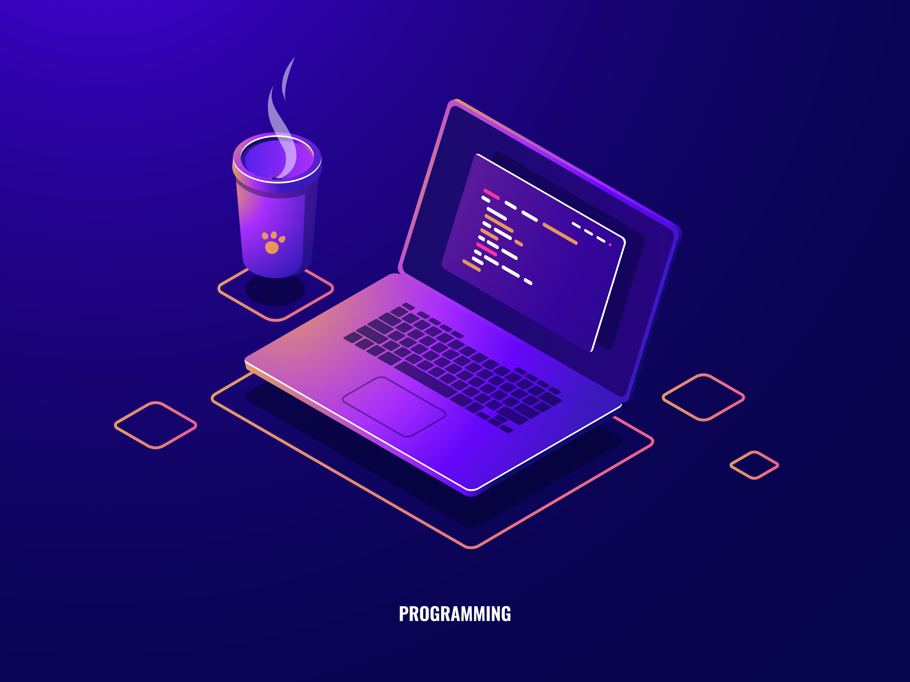

<!-- 🧩 TOP AREA (add your banner later) -->

  

 

## 👋 Hi, I'm Amrito Kundu  
### Building real-world apps • Backend systems • AI tools

 

### 🧠 About Me

- 🌱 Learning **Python, Backend & System Design**  
- 💡 Building **AI tools & useful applications**  
- ⚡ Focused on **shipping real products**  
- 🎯 Improving **problem solving & architecture skills**  

 

 

### 🛠️ Tech Stack

  
  
  
  
  
  
  
  

 

### 🚀 What I'm Building

- 🤖 AI-powered tools  
- 🌐 Full-stack web apps  
- ⚙️ Backend systems for real use cases  

 

### 🌐 Connect

  

 

### ✨ Philosophy

> Build things that people actually use.  
> Not just projects — **products.**

 

  <i>Simple • Useful • Real</i>

